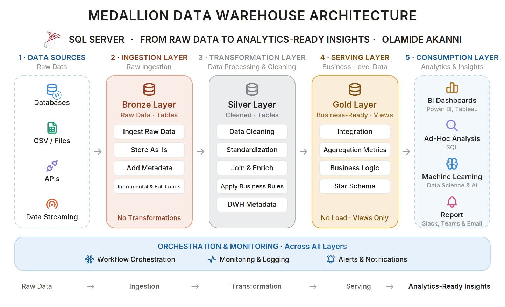
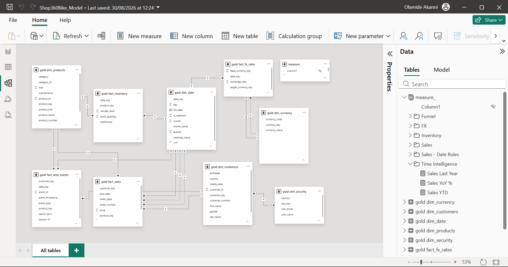

# Shop 360 Bike - Medallion Data Warehouse & Analytics Platform

An end-to-end data platform for a UK bike retailer, built on Microsoft SQL Server.
The project ingests from four heterogeneous source systems, transforms through a Bronze → Silver →
Gold medallion architecture, models a star schema for analytics, and serves a governed Power BI
semantic layer with row-level security. Orchestration, logging, successful pipeline run or failure alerting are included
and tested.

**Stack:** Microsoft SQL Server (Express) · T-SQL · Python 3 · Bash · Power BI · DAX · Slack webhooks · Windows Task Scheduler

---

## Table of contents

1. [Why this project exists](#why-this-project-exists)
2. [Architecture](#architecture)
3. [Source systems](#source-systems)
4. [The medallion layers](#the-medallion-layers)
5. [Data model](#data-model)
6. [Orchestration and observability](#orchestration-and-observability)
7. [Power BI semantic layer](#power-bi-semantic-layer)
8. [Data quality findings](#data-quality-findings)
9. [Repository structure](#repository-structure)
10. [Setup and running the pipeline](#setup-and-running-the-pipeline)
11. [Design decisions and trade-offs](#design-decisions-and-trade-offs)
12. [Roadmap](#roadmap)
13. [Licence](#licence)

---

## Why this project exists

## Why this project exists

The scope goes beyond a single flat-file source, one fact table or a set of SELECT statements. 

It was built to answer questions that only surface once a warehouse has to serve a real business:

- What happens when the data you need sits in another unit's operational system rather than in a file someone sends you?
- What happens when part of the picture only exists outside the organisation, behind a third-party API?
- What happens when the business wants behavioural analytics, and the source is a continuous stream of events rather than a nightly batch?
- How do you model a fact that references the same dimension twice?
- How do you know the pipeline failed at 2am?
- How do you stop a regional manager from seeing another region's revenue?

Every section below exists because one of those questions needed a working answer rather than a diagram.


---

## Architecture


   

| Layer | Object type | Load pattern | Transformations |
|---|---|---|---|
| **Bronze** | Tables | Truncate & insert, full load | None — data lands exactly as the source provided it |
| **Silver** | Tables | Truncate & insert, full load | Cleansing, standardisation, type casting, derived keys, deduplication |
| **Gold** | Views (+ one table) | None — views resolve at query time | Integration, business logic, surrogate keys, star schema |

Gold is views rather than materialised tables. Views cost query time but guarantee the presentation
layer can never drift from Silver, and they make lineage readable — the transformation is the
object definition. `gold.dim_date` is the exception: it has no source system, so it is generated
once as a physical table.

```

```

---

## Source systems

 *Source systems landing in Bronze, cleansed in Silver, modelled as a star schema in Gold.*
```

 SOURCES                    WAREHOUSE (SQL Server)                    CONSUMPTION
─────────                  ──────────────────────────                ───────────

CRM extracts (CSV)  ┐
ERP extracts (CSV)  ├──►   BRONZE ──► SILVER ──► GOLD          ──►   Power BI
BikeShopOLTP (DB)   │      raw       cleaned    star schema          semantic model
exchangerate-api    │      as-is     typed      business-ready       + RLS
clickstream (Py)    ┘      tables    tables     views + dim_date
                                                                     Ad-hoc SQL
                           ▲                                          
                           └── dbo.etl_log, dbo.run_full_pipeline     ML- Predictions
                               run_pipeline.bat, Slack alerting

```

### 1. CRM — CSV extracts
`cust_info.csv`, `prd_info.csv`, `sales_details.csv`. Customer master, product catalogue with
historised start/end dates, and 60,398 sales order lines. Loaded via `BULK INSERT`.

### 2. ERP — CSV extracts
`CUST_AZ12.csv` (birthdate, gender), `LOC_A101.csv` (country), `PX_CAT_G1V2.csv` (product
category hierarchy). Same customer entity as CRM but keyed differently and with inconsistent
formatting — `NASAW00011000` vs `AW-00011000` vs `AW00011000`. Resolving that is Silver's job.

### 3. BikeShopOLTP — a separate operational database
A second SQL Server database holding `dbo.products` and `dbo.inventory`: daily stock snapshots
across six UK warehouses (London, Manchester, Edinburgh, Glasgow, Cardiff, Belfast). Bronze reads
it via a cross-database query, which is how a warehouse normally pulls from an operational system
on the same instance.

`BikeShopOLTP` is deliberately self-contained — it loads its own product catalogue from the CRM


### 4. exchangerate-api.com — live REST API
`fetch_fx_rates.py` pulls GBP→USD/EUR/CAD/AUD daily rates and writes them to `bronze.fx_rates`.
The API key is read from `.env` via `python-dotenv` and never appears in source control.

### 5. Clickstream — generated  events
`generate_web_events.py` simulates 500 browsing sessions against real product and customer keys
pulled from the warehouse, producing a realistic funnel: every session opens with a `page_view`,
60% search, 40% view a product, 35% of those add to cart, 40% of those click purchase. Roughly
70% of sessions are anonymous, so `customer_id` is null on most events — by design, and the reason
`fact_web_events` has nullable foreign keys.

---

## The medallion layers

### Bronze — land it, don't touch it

Nine tables. `TRUNCATE` then `BULK INSERT` (CSV) or `INSERT ... SELECT` (cross-database) or
`executemany` (Python). No cleansing, no type coercion beyond what the DDL enforces, no derived
columns. If the source sends `20101229` as an integer, Bronze stores an integer.

The point of Bronze is that you can always answer "what did the source actually send us?" without
re-extracting.

### Silver — clean, standardise, conform

Nine tables mirroring Bronze, plus a `dwh_create_date` audit column on each. The substantive work:

**Deduplication.** `crm_cust_info` has repeated `cst_id` values. A
`ROW_NUMBER() OVER (PARTITION BY cst_id ORDER BY cst_create_date DESC)` keeps the most recent
record per customer.

**Date reconstruction.** Sales dates arrive as integers (`20101229`). Zeroes and malformed values
become NULL rather than nonsense dates.

**Derived business columns.** `prd_key` carries a composite: `CO-RF-FR-R92B-58`. Silver splits it
into `cat_id` (`CO_RF`, joining to the ERP category table) and `prd_key` (`FR-R92B-58`, joining to
sales).

**Product lifecycle.** `prd_end_dt` is computed with
`LEAD(prd_start_dt) OVER (PARTITION BY prd_key ORDER BY prd_start_dt) - 1`, so each product version
ends the day before its successor begins. The current version has a NULL end date — that filter is
what Gold uses to expose 295 current products from 397 historical rows.

**Value repair with rules, not guesses.** Where `sls_sales` disagrees with `quantity × price`, it
is recalculated. Where `sls_price` is null or non-positive, it is derived from
`sales / NULLIF(quantity, 0)`. The `NULLIF` prevents divide-by-zero rather than trapping it.

**Normalisation.** `M`/`F` → `Male`/`Female`. `S`/`M` → `Single`/`Married`. `DE` → `Germany`,
`US`/`USA` → `United States`. Blanks → `n/a` rather than NULL, so grouped reports show an explicit
bucket.

**Key derivation.** Inventory, FX and web events each get a `date_key` derived from their native
timestamp (`CAST(CONVERT(VARCHAR(8), snapshot_date, 112) AS INT)`), giving all four facts a common
join to `gold.dim_date`.

### Gold — model it for the business

Nine views plus one generated table.

| Object | Type | Grain |
|---|---|---|
| `gold.dim_date` | Table | One row per calendar day, 2015-01-01 → 2035-12-31 (7,670 rows) |
| `gold.dim_customers` | View | One row per customer (18,484) |
| `gold.dim_products` | View | One row per current product (295) |
| `gold.dim_currency` | View | One row per currency (5) |
| `gold.dim_security` | View | One row per user-country grant (12) |
| `gold.fact_sales` | View | One row per order line (60,398) |
| `gold.fact_inventory` | View | One row per product × warehouse × day (8,850) |
| `gold.fact_fx_rates` | View | One row per currency pair × day |
| `gold.fact_web_events` | View | One row per clickstream event |
| `gold.vw_fx_rates_readable` | View | Reporting convenience — FX with currency codes rather than keys |

`dim_date` is built with a recursive CTE and `OPTION (MAXRECURSION 0)`. It carries both `date_key`
(integer, for joining) and `full_date` (DATE, for Power BI DAX time intelligence) — the same table serving
two different consumers.

Surrogate keys are generated with `ROW_NUMBER()` in the dimension views, keeping warehouse keys
independent of source system identifiers.

---

## Data model

A star schema with four fact tables radiating from five conformed dimensions.




### Role-playing dimensions

Two facts reference the same dimension more than once. Both are handled with inactive relationships
and `USERELATIONSHIP()` rather than by duplicating the dimension.

**`fact_sales` → `dim_date`, three times.** `order_date`, `shipping_date` and `due_date` are three
roles of the same calendar. `order_date` holds the active relationship because "revenue by month"
means the month the order was placed. The other two are inactive.

**`fact_fx_rates` → `dim_currency`, twice.** `base_currency_key` and `target_currency_key`. Target
is active — "what was the GBP→USD rate" is the question people ask.

### Relationship rules

Fourteen relationships. All cardinality is one-to-many except the security bridge. All cross-filter
directions are Single, dimension → fact. Bidirectional filtering is avoided entirely: with four
facts sharing dimensions it creates ambiguous filter paths that either block relationship creation
or, worse, silently return wrong numbers.

The one many-to-many is `dim_security` → `dim_customers` on `country`, which is the standard shape
for a security bridge table.

---

## Orchestration and observability

SQL Server Express has no SQL Server Agent, so scheduling is handled by Windows Task Scheduler
invoking a batch file. `SQL_server_agent_job.sql` refference documents the equivalent Agent job for a
Standard/Enterprise deployment.

### Execution flow

```
Windows Task Scheduler (daily 02:00)
        │
        ▼
run_pipeline.bat
        │
        ├─► fetch_fx_rates.py        ──► bronze.fx_rates
        ├─► generate_web_events.py   ──► bronze.web_events
        └─► sqlcmd -b: EXEC dbo.run_full_pipeline
                    │
                    ├─► bronze.load_bronze
                    ├─► bronze.load_brz_inventory
                    ├─► silver.load_silver
                    ├─► silver.load_slv_inventory
                    ├─► silver.load_slv_fx_rates
                    └─► silver.load_slv_web_events
                              │
                              ▼
                        dbo.etl_log        ──► Slack webhook
```

Gold requires no load step — the views resolve against Silver on query.

### Logging

`dbo.log_and_run` wraps every step. It takes a run ID and a procedure name, executes it via dynamic
SQL, and records start time, end time, duration, status and any error message to `dbo.etl_log`.
One `run_id` groups all steps from a single pipeline run, so a failed run is one query away:

```sql
SELECT pipeline_step, status, duration_sec, error_message
FROM dbo.etl_log
WHERE run_id = (SELECT TOP 1 run_id FROM dbo.etl_log ORDER BY log_id DESC)
ORDER BY log_id;
```

### Failure propagation — and why it needed testing

An error has to survive four handoffs to reach a human:

```
INSERT fails → stored procedure → sqlcmd → batch file → Slack
```

Each handoff can silently drop it:

- A `CATCH` block that prints and returns normally looks like success to the caller. Every load
  procedure therefore ends its `CATCH` with `THROW;` to re-raise.
- `sqlcmd` exits 0 by default even when the T-SQL failed — it reports "I sent the batch," not "the
  batch worked." The `-b` flag makes it exit non-zero on error.
- Batch files need `if %errorlevel% neq 0` rather than the older `if errorlevel 1` form.

Fixing only one of these changes nothing. All three are required for a failure to travel end to
end.

**This was verified, not assumed.** Renaming `silver.inventory` mid-pipeline produced a FAILED row
in `etl_log` and a ❌ Slack alert. Before the fixes, the same broken run reported SUCCESS. Alerting
that reports green on a broken pipeline is worse than no alerting, because you stop checking it.

---

## Power BI semantic layer

Import mode against the Gold views.


### Measure library

All DAX lives in a dedicated `measure_` table, organised into display folders — `Sales`,
`Sales - Date Roles`, `Inventory`, `Funnel`, `Time Intelligence`, `FX`. Report builders drag
measures; they never write DAX. Change a definition once and every report follows.

Representative measures:

```dax
Total Sales = SUM('gold fact_sales'[sales_amount])

Average Order Value = DIVIDE([Total Sales], [Order Count])

Sales by Ship Date =
CALCULATE(
    [Total Sales],
    USERELATIONSHIP('gold dim_date'[full_date], 'gold fact_sales'[shipping_date])
)

Conversion Rate = DIVIDE([Purchase Clicks], [Page Views])

Sales YoY % = DIVIDE([Total Sales] - [Sales Last Year], [Sales Last Year])
```

`DIVIDE` rather than `/` throughout — it returns blank on divide-by-zero instead of an error.

### Row-level security

`gold.dim_security` maps user emails to countries. A single role, `Location Access`, filters
`dim_customers`:

```dax
[country] IN CALCULATETABLE(
    VALUES('gold dim_security'[country]),
    'gold dim_security'[user_email] = USERPRINCIPALNAME()
)
```

The filter cascades `dim_security → dim_customers → fact_sales` and `→ fact_web_events`, so one
relationship secures two facts. Six Location Marketing Managers hold one country each; one Global
Marketing Manager holds six rows, one per country — demonstrating that the same rule handles both
scoped and unrestricted access without a second role.

`fact_inventory` and `fact_fx_rates` are deliberately unsecured: warehouse stock and exchange rates
are not country-sensitive.

Tested with **View as** for both a scoped user and the global user.

### Conversion funnel

Built from `fact_web_events`:

| Stage | Events |
|---|---|
| Page views | 500 |
| Product views | 193 |
| Add to cart | 72 |
| Purchase clicks | 24 |

End-to-end conversion 4.8%.

---

## Data quality findings

Three issues were found in the source data. None were silently patched.

### Sales predate customer creation

`cust_info.csv` carries create dates from October 2025 to January 2026. `sales_details.csv` carries
transactions from 2010 to 2014. The two files were generated independently and were never
reconciled: **60,379 of 60,398 sales rows predate their customer's create date.**

Not corrected. Fixing it would mean inventing create dates to make a chart look tidy. The practical
consequence is that `create_date` must not be used to compute customer tenure or "new customers per
month" — both are derived from first order date instead, which is arguably the better definition
anyway.

### Sources living in different eras

Sales ran 2010–2014 while inventory, FX and clickstream all sat in 2026. No cross-fact analysis was
possible across a twelve-year gap.

Resolved by rebasing sales dates forward twelve years in the Silver layer:

```sql
DATEADD(YEAR, 12, CAST(CAST(sls_order_dt AS VARCHAR) AS DATE))
```

Twelve years keeps months and seasonality intact (October stays October) and lands the history at
2022-12-29 → 2026-01-28, inside `dim_date` and adjacent to the other three facts. Product start and
end dates were shifted identically so the catalogue timeline stays consistent with the transactions
referencing it.

This is a documented transformation, not a cleansing step — it is commented in
`proc_load_slv_crm_erp.sql` and disclosed here. Birthdates were deliberately *not* shifted:
shifting an attribute date would make every customer twelve years younger and corrupt any age
analysis. The rule applied was **shift event dates, never attribute dates.**

### Null order dates

19 of 60,398 sales rows have malformed source order dates (zeroes or wrong-length integers) and are
nulled in Silver. At 0.03% this is immaterial; the rows land in a blank date bucket in Power BI.
Left as NULL rather than assigned a sentinel date, because there is no date value that honestly
means "unknown."

---

## Repository structure

```
├── 01_docs/                        Architecture diagrams, data catalog, naming conventions
├── 02_datasets/
│   ├── crm/                        CRM extracts (customers, products, sales)
│   └── erp/                        ERP extracts (demographics, geography, categories)
├── 03_scripts/
│   ├── 3.1 setup/                  Database + schema creation, bronze & silver DDL
│   ├── 3.2 source_systems/
│   │   ├── db_OLTP/                BikeShopOLTP database and inventory generator
│   │   └── python_ingestion/       FX API client, clickstream generator
│   ├── 3.3 bronze/                 Bronze DDL for external sources + load procedures
│   ├── 3.4 silver/                 Silver DDL for external sources + load procedures
│   ├── 3.5 gold/                   dim_date generator, star schema views
│   ├── 3.6 orchestration_/         etl_log, log_and_run, master pipeline, batch file, Slack alerts
│   └── server_agent_job_ref.sql    SQL Agent job definition (Standard/Enterprise reference)
├── 04_test/                        Silver and gold quality checks, view definition inspector
├── 05_analytics/
│   ├── 5.1 PowerBI/                Semantic model and reports
│   └── 5.2 ML/                     Churn modelling (planned)
├── LICENSE
└── README.md
```

---

## Setup and running the pipeline

### Prerequisites

- SQL Server 2019 Express or later, plus SSMS
- Python 3.9+
- A free API key from [exchangerate-api.com](https://www.exchangerate-api.com/)
- A Slack incoming webhook URL (optional — alerting only)

```bash
pip install requests pyodbc python-dotenv
```

Create a `.env` alongside the Python scripts:

```
FX_API_KEY=your_key_here
SLACK_WEBHOOK_URL=https://hooks.slack.com/services/...
```

### Build order

Run in SSMS, in sequence:

```
1.  03_scripts/3.1 setup/DWh_schemas.sql            Database + bronze/silver/gold schemas
2.  03_scripts/3.1 setup/ddl_bronze.sql             Bronze CRM/ERP tables
3.  03_scripts/3.3 bronze/ddl_ext_source            Bronze inventory, fx_rates, web_events
4.  03_scripts/3.1 setup/ddl_silver.sql             Silver CRM/ERP tables
5.  03_scripts/3.4 silver/ddl_ext_source.sql        Silver inventory, fx_rates, web_events
6.  03_scripts/3.2 source_systems/db_OLTP/*.sql     BikeShopOLTP source database
7.  03_scripts/3.6 orchestration_/ddl_etl_log.sql   Pipeline log table
8.  All load procedures in 3.3 and 3.4              Bronze and silver loaders
9.  03_scripts/3.6 orchestration_/proc_*.sql        log_and_run, run_full_pipeline
10. 03_scripts/3.5 gold/ddl_gold_dim_date.sql       Date dimension
11. 03_scripts/3.5 gold/ddl_gold_views.sql          Star schema views
```

CSV paths in `bronze.load_bronze` and `dbo.inventory.sql` point at a local dataset folder — adjust
to your clone location before running. The SQL Server service account needs read access to that
folder, since `BULK INSERT` runs as the service rather than as the calling user.

### Running

Full pipeline including Python ingestion:

```
cd path\to\pipeline\folder
run_pipeline.bat
```

SQL layers only:

```
sqlcmd -S localhost\SQLEXPRESS -d DataWarehouse -Q "EXEC dbo.run_full_pipeline;" -b
```

Check the result:

```sql
SELECT pipeline_step, status, duration_sec, error_message
FROM dbo.etl_log
WHERE run_id = (SELECT TOP 1 run_id FROM dbo.etl_log ORDER BY log_id DESC)
ORDER BY log_id;
```

Six rows, all SUCCESS.

### Testing the failure path

```sql
EXEC sp_rename 'silver.inventory', 'silver_inventory_temp';
EXEC dbo.run_full_pipeline;                    -- expect FAILED in etl_log + Slack alert
EXEC sp_rename 'silver.silver_inventory_temp', 'inventory';
```

---

## Design decisions and trade-offs

**Gold as views, not tables.** Views cannot drift from Silver and their definitions document the
transformation. The cost is query-time computation on every read. At this volume that is free; at
100× it would warrant materialising the fact views and keeping the dimensions as views.

**The source system owns its own data.** An earlier version seeded `BikeShopOLTP.dbo.inventory`
from `gold.dim_products` — convenient, but it made the source system depend on the warehouse that
consumes it, and the script would fail on a clean install because Gold does not exist yet.
`BikeShopOLTP` now loads its own product catalogue from the CRM extract, applying the same
`SUBSTRING` and `LEAD` logic Silver uses so the 295 product numbers still match downstream. Data
flows one direction only.

**Date rebasing lives in Silver, not Bronze.** Bronze must always reflect what the source sent.
Silver is where business logic belongs, and "rebase dates so the sources share a timeline" is
business logic. The consequence is that Silver no longer reconciles row-for-row against the CSV on
date columns — documented in the script so it does not become a debugging mystery later.

**Role-playing over duplicated dimensions.** Three date roles could have been three copies of
`dim_date`. That would let report builders drag "ship month" directly onto a visual without a
measure, at the cost of three near-identical dimensions in the model. Inactive relationships plus
`USERELATIONSHIP` keeps the model clean and scales better past two roles. The trade-off is that
each alternate role needs its own measure.

**Security on the customer dimension, not geography.** `dim_customers` reaches both `fact_sales`
and `fact_web_events`, so one relationship secures two facts. Securing a geography dimension would
have reached only one.

**Single-direction cross-filtering, always.** With four facts on shared dimensions, bidirectional
filtering creates loops the engine cannot resolve. Where a bidirectional filter seems necessary,
the answer is nearly always a measure instead.

---

## Roadmap

- **Churn model** — RFM segmentation over `fact_sales`, then a classifier on the resulting features
- **FX history** — `fetch_fx_rates.py` currently truncates on each run, so `fact_fx_rates` holds a
  single day. Switching to append unlocks rate trends and multi-currency revenue restatement
- **Incremental loads** — full truncate-and-insert is correct at this volume; watermark-based
  incremental loading is the next step at scale
- **Data catalog and naming conventions** — `01_docs/` is scaffolded and awaiting content
- **Slowly changing dimensions** — `crm_prd_info` already carries the start/end date structure for
  SCD Type 2; Gold currently exposes only the current version

---

## Licence

MIT — see [LICENSE](LICENSE).

Source datasets derive from the Microsoft AdventureWorks sample database. Inventory, FX and
clickstream data are generated; see [Data quality findings](#data-quality-findings) for the
transformations applied.

---

**Olamide Akanni** · [LinkedIn](https://linkedin.com/in/) · [GitHub](https://github.com/)

